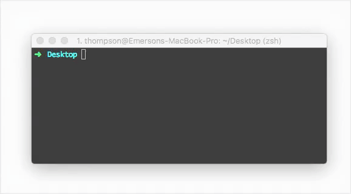

# CLI - Arroxa
[](https://travis-ci.org/arroxa/cli)
[](https://badge.fury.io/gh/arroxa%2Fcli)
[](http://badge.fury.io/js/arroxa)
> Pensando em agilizar o processo de inicialização de projetos, que é o principal objetivo do `Arroxa`, foi criado o `CLI do Arroxa` ツ. <br>
Não, não é nenhum sucesso musical, é apenas uma maneira mais rápida e prática para "clonar" os nossos projetos.

<p align="center">
  
</p>

## Instalando
Intalar com [NPM](https://www.npmjs.com/)
```bash
$ npm install -g arroxa
```

## Como usar
Abra o terminal e digite `$ arroxa`, será listado os repositórios disponível para você arroxar no seu projeto


### Contribuir
Ajude-nos a melhorar nossa aplicação. Abra uma [issue](https://github.com/arroxa/cli/issues/new) ou  envie um `pull request`.
- [Fork nosso repositório!](https://github.com/arroxa/cli#fork-destination-box)
- Crie sua "feature branch": `git checkout -b minha-nova-feature`
- Comente suas alterações: `git commit -m 'Comentando minha feature'`
- Suba sua branch: `git push origin minha-nova-feature`
- Nos envie seu pull request =D

[](https://github.com/feross/standard)

### Licença
[MIT License](http://arroxa.mit-license.org/) © Arroxa
